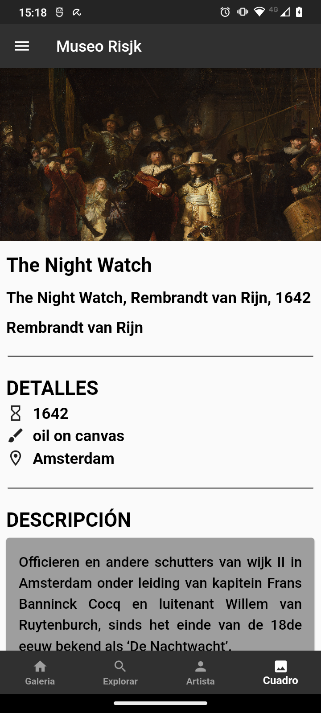

# Demo App Museo Rijks

Introducción

Esta es una aplicación del Museo Rijks desarrollada en Flutter. La aplicación presenta varias pantallas para mostrar información sobre obras de arte, artistas y detalles específicos de cada obra.

## Características Principales

- **Pantalla de Inicio:** Botón para iniciar la navegación.

- **Galería de Obras:** Muestra una colección de obras de arte. Permite hacer clic en una obra para ver a pantalla completa. Ademas de permitir hacer click en el nombre de la obra y direccionarte a la pantalla Obra, para ver detalles especificos de las misma.

- **Buscador de Artistas:** Permite buscar y filtrar artistas, Permite cliclear en un artista y direccionarte a la pantalla Galeria de Artista .

- **Galería por Artista:** Muestra una galería de las principales obras de un artista seleccionado. Tambien permite hacer click en el nombre de la obra y direccionarte a la pantalla Obra

- **Detalles de una Obra:** Proporciona información detallada sobre una obra de arte, incluyendo imágenes, títulos y detalles técnicos.

## Configuración y Dependencias

Flutter: Framework de desarrollo de aplicaciones móviles multiplataforma.

La aplicación utiliza las siguientes dependencias principales:

- `provider`: Manejador de estado para compartir datos entre diferentes partes de la aplicación.

- `http`: Para realizar solicitudes HTTP para obtener datos de la API del Museo Rijks..

API del Museo Rijks

La aplicación utiliza la API pública del Museo Rijks para obtener información sobre las obras de arte. Puedes encontrar más información sobre la API en la siguiente dirección: https://museorijks.onrender.com/

